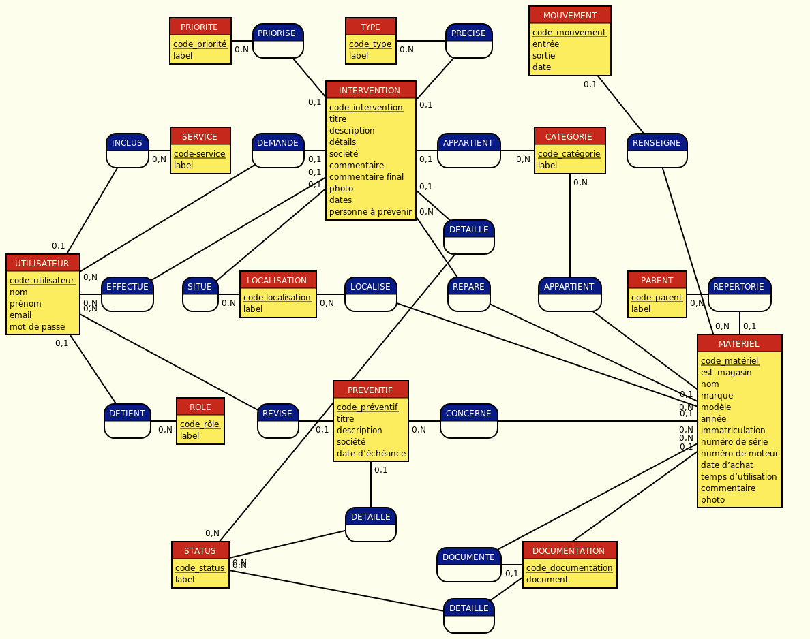

# MCD 

PRIORITE: code_priorité, label
PRIORISE, 0N PRIORITE, 01 INTERVENTION
TYPE : code_type, label
PRECISE, 0N TYPE, 01 INTERVENTION
MOUVEMENT : code_mouvement, entrée, sortie, date

INCLUS, 0N SERVICE, 01 UTILISATEUR
SERVICE : code-service, label
DEMANDE, 0N UTILISATEUR, 01 INTERVENTION
INTERVENTION : code_intervention, titre, description, détails,société, commentaire, commentaire final,photo, dates, personne à prévenir
APPARTIENT2, 0N CATEGORIE, 01 INTERVENTION
CATEGORIE : code_catégorie, label
RENSEIGNE, 01 MOUVEMENT, 0N MATERIEL
:

:
:
DETAILLE2, 0N STATUS, 01 INTERVENTION

UTILISATEUR : code_utilisateur, nom, prénom,email, mot de passe
EFFECTUE, 0N UTILISATEUR, 01 INTERVENTION
SITUE, 0N LOCALISATION, 01 INTERVENTION
LOCALISATION : code-localisation, label
LOCALISE, 0N LOCALISATION, 01 MATERIEL
REPARE,  0N MATERIEL , 0N INTERVENTION
APPARTIENT, 0N CATEGORIE, 01 MATERIEL
PARENT : code_parent, label
REPERTORIE, 0N PARENT, 01 MATERIEL
:

DETIENT, 01 UTILISATEUR, 0N ROLE
ROLE : code_rôle, label
REVISE, 0N UTILISATEUR, 01 PREVENTIF
PREVENTIF : code_préventif, titre, description,société, date d'échéance
CONCERNE, 0N PREVENTIF, 0N MATERIEL
:
:
MATERIEL : code_matériel,est_magasin, nom, marque, modèle, année, immatriculation, numéro de série, numéro de moteur, date d'achat, temps d'utilisation, commentaire, photo

DETAILLE3, 01 PREVENTIF, 0N STATUS
:

STATUS : code_status, label
:
:
DOCUMENTE, 0N MATERIEL, 01 DOCUMENTATION
DOCUMENTATION : code_documentation, document

:
:
DETAILLE, 0N STATUS, 01 MATERIEL

[lien Mocodo](https://www.mocodo.net/?mcd=eNqNVM2OmzAQvvspfOuFSv255YaId2WJAAISqafKBe_GEmBqm5X6Nj02974BL9axwQSSrNRESjz2zOeZb75xltM0pyXZ4UrW_HuvhFTCjJcAN-wHb1DmzgsS4E8JzmZnMD5jmpQkP5GkpGmCym8ZwTOG-dXzaziJfLT1uY88pMcTOYDhw1s5vPGWdybA8KPGC4BpqYyA_5oZjuBDkyg-Fg61ACgaTcDHksa0CEtyzNG8P6N-1Fy9iWrJa08OYbKf8lpF3ae3NnyGojOABskJ2QXYCKNsalxXSvTTXj1eDBONDrSsBKwtn5VsbVVMWO-VgV9Ex5qgP0sjpwp1gHuutOw6jsffuAcO4DahUJhlYV5SyOaLyzyCpJ-hIw9oXY580hWDLF6huQsHOUkKQp-TKXrpg0M-QDgEx2gHbO_guydlSOOYTBcXZVg6_m9uRSsu_cWDEY3QUNagAtzJNnAF2QVvgaMAt9IAe7hnWnNEnp5IVB7_ozMF9W5xGoXOD7bv_danXg2NrJhLynVromP2ewdyISQn0ANwWrOEXczm1murHnRqAbNQV-X3TDnZ-_ZkJC_nGJg957oNh-ZAX6jf39KV4DyNCbI__gI1_m1W7T_5am95hql1dTyhZbXkOInRiJeHyl_p3SoZ1x_GS3UeL6yrOIrSJCJ54t-SGflWbzu00OpfBCtdEG4TcG3AemVadLOWWqZ-DtyKqB7_2OJY17knQ7QQpkQ1NHOXu6EFFGmlph3cZgtE6AQ6Z82qM4NOGN72GkyvYQe0GWQ3tggt8_F1S-BqWtwoTUtfmDbMDNo3xI1ZGh3tEJINKw7THzlNoo3l8WpZDS61-RWaze0E3w7wQj36B0ZF3Lw=)

